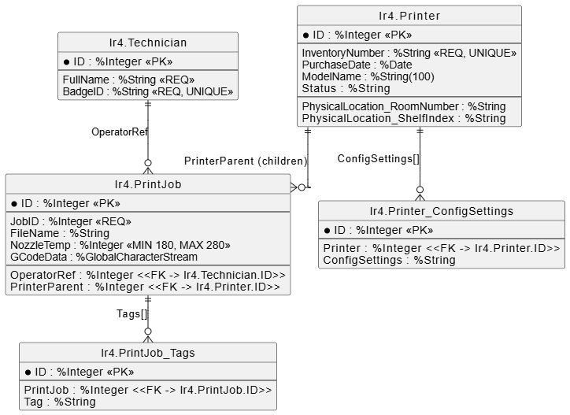

# Graphic Work — 3D Printer Farm (Post-Relational Databases / IRIS)

This graphic work is based on my **3D Printer Farm** domain model that I implemented in the previous practical/laboratory works (InterSystems IRIS).
The goal is to represent the same system from different viewpoints: **relational (ER)**, **object-oriented (UML classes)**, **runtime instances (objects)**, and **system behavior (sequence)**.

---

## 1) Relational Database Schema (ER / Relational View)

### What this diagram shows
This schema reflects how IRIS persistent classes are mapped to a **relational** representation:

- **`lr4.Printer`** — the main table for printers.
  - Contains inherited fields from `Device`:
    - `PurchaseDate`
    - `InventoryNumber` (**Required**, **Unique**)
  - Also stores printer-specific fields:
    - `ModelName`, `Status`
  - The embedded serial object `PhysicalLocation` (`Location`) is **flattened** into columns:
    - `PhysicalLocation_RoomNumber`
    - `PhysicalLocation_ShelfIndex`

- **`lr4.Technician`** — technicians/operators.
  - `FullName` is **Required**
  - `BadgeID` is **Unique**

- **`lr4.PrintJob`** — print jobs.
  - Has required and constrained fields:
    - `JobID` (**Required**)
    - `NozzleTemp` (**Min=180**, **Max=280**)
  - Contains foreign keys (references):
    - `OperatorRef → lr4.Technician.ID`
    - `PrinterParent → lr4.Printer.ID`
  - This table represents the **many-side** of relations.

- **`lr4.Printer_ConfigSettings`** — separate table for `ConfigSettings`.
  - In the model, `ConfigSettings` is an **Array<String>**.
  - IRIS stores array values as a separate table linked to `Printer`.

- **`lr4.PrintJob_Tags`** — logical table for `Tags`.
  - In the model, `Tags` is a **List<String>**.
  - For a relational view, list items are represented as a separate table of values linked to `PrintJob`.

### Key relationships
- **Technician (1) → (0..*) PrintJob**  
  A single technician can be assigned as an operator to many print jobs.
- **Printer (1) → (0..*) PrintJob** (Parent–Child)  
  A printer contains many jobs; jobs belong to exactly one parent printer.
- **Printer (1) → (0..*) Printer_ConfigSettings**  
  Array values are stored separately and reference the printer.
- **PrintJob (1) → (0..*) PrintJob_Tags**  
  List values are stored separately and reference the print job.

---

## 2) Class Diagram (UML)

### What this diagram shows
The class diagram represents the **object model** (how the system is designed in OOP terms):

- **`Device` (Abstract)**  
  Base class that defines common device information:
  - `PurchaseDate`
  - `InventoryNumber` (**required**, **unique**)

- **`Printer` extends `Device`**
  - `Status`
  - `ModelName` *(MaxLen = 100)*
  - `ConfigSettings : Array<String>`
  - `PhysicalLocation : Location` *(embedded serial object)*
  - `LocationLabel : String` *(calculated / computed property)*

- **`Location` (Serial / Embedded)**
  - `RoomNumber`
  - `ShelfIndex`
  This is not stored as a separate persistent entity; it is embedded into `Printer`.

- **`PrintJob`**
  - `FileName`
  - `GCodeData`
  - `Tags : List<String>`
  - `JobID` (**required**)
  - `NozzleTemp` (**min 180, max 280**)
  - Links:
    - `PrinterParent : Printer` *(parent reference)*
    - `OperatorRef : Technician` *(reference)*

- **`Technician`**
  - `FullName` (**required**)
  - `BadgeID` (**unique**)

### OOP relationships
- **Inheritance**: `Printer` inherits from abstract `Device`.
- **Composition (embed)**: `Printer` embeds `Location` as `PhysicalLocation`.
- **Parent–Child**: `Printer` is a parent for many `PrintJob` instances (children).
- **Reference**: each `PrintJob` references one `Technician` as its operator.

---

## 3) Object Diagram (Runtime Instances)

### What this diagram shows
The object diagram is a snapshot of the system at runtime, showing **real instances** and their links:

- `p1:Printer`
  - Concrete values: `InventoryNumber`, `PurchaseDate`, `ModelName`, `Status`
  - `ConfigSettings` shown as an example list of values
  - `LocationLabel` is shown as a computed result
- `loc1:Location`
  - `RoomNumber = "101"`
  - `ShelfIndex = "B"`
  - Connected to printer via `PhysicalLocation`
- `t1:Technician`
  - Represents the operator responsible for jobs
- `j1:PrintJob` and `j2:PrintJob`
  - Both are linked to the same parent printer (`Jobs[1]`, `Jobs[2]`)
  - Both reference the same technician via `OperatorRef`
  - Both demonstrate `Tags` values

### Why this diagram is useful
It confirms that:
- embedded objects (`Location`) are part of the printer object,
- parent–child relations connect printers to jobs,
- references connect jobs to technicians,
- constraints/required fields are represented through realistic values.

---

## 4) Sequence Diagram (Cascade Delete Scenario)

### Scenario: Deleting a Printer with Cascade Deletion of Jobs
This scenario corresponds to the behavior verified in unit testing:
when a **parent printer** is deleted, all its **child print jobs** must also be deleted.

### Main participants
- **Tester / User** — initiates the operation
- **UnitTest / App Logic** — executes create/delete actions
- **`lr4.Printer`** — parent entity
- **`lr4.PrintJob`** — child entity
- **IRIS DB** — persistence layer that performs physical delete operations

### Steps
1. **Arrange**: Create a printer and multiple child jobs, then save them.
2. **Act**: Delete the printer by ID (`%DeleteId(PrinterId)`).
3. **DB Cascade**:
   - IRIS finds all child `PrintJob` rows referencing `PrinterParent`.
   - Deletes child jobs first.
   - Deletes the printer record.
4. **Assert**: Verify that both printer and jobs no longer exist (`%ExistsId(...) = 0`).

### Why this diagram matters
It demonstrates correct implementation of:
- **parent–child relationship**
- **cascade delete behavior**
- **data integrity** (no orphaned jobs remain)

---

## Files
All diagrams are stored in:

- `./pictures/ER Relational schema.png`
- `./pictures/Class Diagram.png`
- `./pictures/Object Diagram.png`
- `./pictures/Sequence Diagram (Cascade Delete).png`
