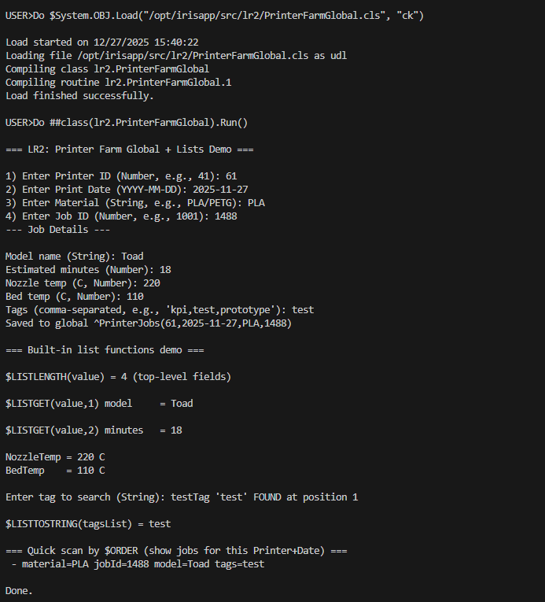

# Practice 2 (Globals + Lists) — InterSystems IRIS

## Task
Create a **global** that has **4 subscripts** of **3 different types** (numbers, dates, strings, lists, etc.).  
Use as a value for nodes **both types of lists**.  
Show usage of at least **4 built-in functions** to work with arrays/lists.  
All parameters should be read from **input device**.  
Global and functions should make sense.

## Solution Theme
**3D Printer Farm — Print Jobs Registry**

We store print jobs in a global where each node represents a single job for a specific printer and date.

### Global Structure
`^PrinterJobs(printerId, printDate, material, jobId) = value`

**4 subscripts (3 types):**
1. `printerId` — **Number**
2. `printDate` — **Date** converted to integer using `$ZDATEH()` (**Number** representation of date)
3. `material` — **String** (PLA, PETG, etc.)
4. `jobId` — **Number**

### Node Value
The node value is a `$LIST` that contains:
- `modelName` (string)
- `estMinutes` (number)
- `tempsList` — list built with `$LISTBUILD()` (binary list)
- `tagsList` — list built with `$LISTFROMSTRING()` (list from string)

This demonstrates **both list creation approaches**.

## Built-in Functions Demonstrated
At least 4 `$LIST*` functions are used:
- `$LISTLENGTH(list)` — count elements
- `$LISTGET(list, i)` — get element by index
- `$LISTFIND(list, value)` — find value position
- `$LISTTOSTRING(list, delimiter)` — convert list to string

Additional (optional) traversal:
- `$ORDER()` — iterate subscripts in the global

## How to Run

### Option A — Using Docker (recommended)
1. Start IRIS container from project root:
   ```bash
   docker compose up -d
   ```
2. Find container name:
   ```bash
   docker ps
   ```
3. Open IRIS terminal inside the container:
   ```bash
   docker exec -it <YOUR_CONTAINER_NAME> iris session IRIS
   ```
4. Compile the class (path depends on your docker volume mapping; common path is `/irisdev/app`):
   ```objectscript
   do $system.OBJ.Load("/irisdev/app/src/lr2/PrinterFarmGlobal.cls","ck")
   ```
5. Run:
   ```objectscript
   do ##class(lr2.PrinterFarmGlobal).Run()
   ```

### Option B — VS Code / Studio (if you use it)
- Open IRIS namespace
- Compile `src/lr2/PrinterFarmGlobal.cls`
- Run `do ##class(lr2.PrinterFarmGlobal).Run()`

## Expected Result
The program will:
- read all required parameters via `READ`
- save a meaningful node into `^PrinterJobs(...)`
- demonstrate list functions output
- scan jobs for the selected printer/date using `$ORDER()`

---

## Demonstration:

Creating new items:


Analyze:

