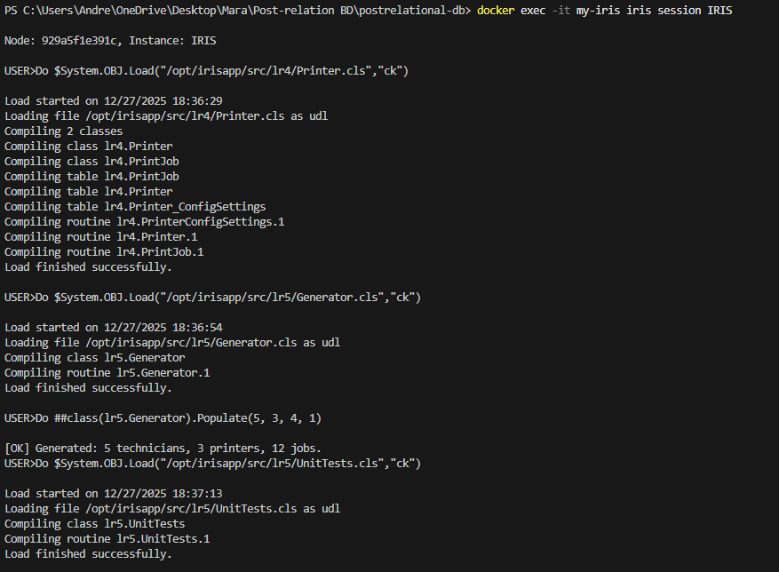
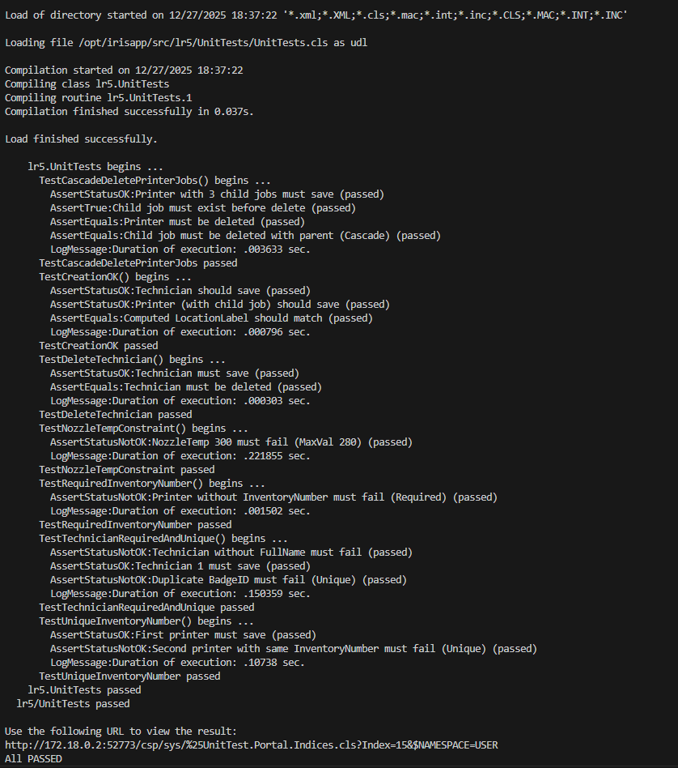

# LR5 — Computed Property + Data Generation + Unit Testing (InterSystems IRIS)

## Task
1. Add an **always computed property** to one of the classes and implement a **getter**.
2. Create code for **automatic data generation** for all classes.
3. Create **Unit Tests** for class/classes with:
   - **unique**, **required**, **constrained** properties
   - **relationships** (parent–children)
   - and ensure tests succeed:
     - object creation
     - unique/required/constraint validation
     - deleting a parent with children
     - deleting a standalone object

---

## Project Structure

```text
lr5/
 ├─ pictures/
 │   ├─ LR5_input.png      # UML diagram
 │   └─ LR5_output.png     # Unit test results
 ├─ UnitTests/
 │   └─ UnitTests.cls
 ├─ Generator.cls
 └─ README.md
```

---

## Domain Model
Theme: **3D Printer Farm** (based on UML from previous labs)

Entities:
- `Device` — base abstract class (`PurchaseDate`, `InventoryNumber`)
- `Printer` — status, model, configuration, embedded location
- `Location` — serial/embedded object (`RoomNumber`, `ShelfIndex`)
- `PrintJob` — child of `Printer`, references `Technician`
- `Technician` — printer operator with unique badge

### Input and generating


---

## 1) Computed Property
Class: `lr4.Printer`  
Property: `LocationLabel` **[Calculated]**

The property is **always computed** from the embedded `PhysicalLocation`
(`lr4.Location`) and is not stored in the database.

Used fields:
- `RoomNumber`
- `ShelfIndex`

Output format:
```
Room <RoomNumber>, Shelf <ShelfIndex>
```

Getter:
```objectscript
Method LocationLabelGet() As %String
```

Additionally, a **Unique index** on `InventoryNumber` is defined in
`lr4.Printer` to correctly enforce uniqueness at the table level.

---

## 2) Data Generation
Class: `lr5.Generator`  
Method: `Populate(techCount, printerCount, jobsPerPrinter, wipe)`

Automatically generates:
- `lr4.Technician` objects
- `lr4.Printer` objects with embedded `lr4.Location`
- `lr4.PrintJob` objects as **children** of printers
- demo `GCodeData` stream and random tags for each job

Respects:
- **Unique** constraints (`BadgeID`, `InventoryNumber`)
- **Required** properties
- **Constraint**: `PrintJob.NozzleTemp` range **180..280**

Example:
```objectscript
Do ##class(lr5.Generator).Populate(5, 3, 4, 1)
```

---

## 3) Unit Testing
Class: `lr5.UnitTests` extends `%UnitTest.TestCase`

Implemented test cases:
- **TestCreationOK** — object creation and computed property validation
- **TestRequiredInventoryNumber** — required property check
- **TestUniqueInventoryNumber** — unique constraint validation
- **TestTechnicianRequiredAndUnique** — required and unique checks
- **TestNozzleTempConstraint** — range constraint validation
- **TestCascadeDeletePrinterJobs** — cascade delete (Printer → Jobs)
- **TestDeleteTechnician** — standalone object deletion

### Unit Test Results


All tests complete successfully with status **ALL PASSED**.

---

## How to Run (Docker / IRIS)

### 1) Compile LR4 model
```objectscript
Do $System.OBJ.LoadDir("/opt/irisapp/src/lr4","ck")
```

### 2) Compile LR5 classes
```objectscript
Do $System.OBJ.Load("/opt/irisapp/src/lr5/Generator.cls","ck")
Do $System.OBJ.Load("/opt/irisapp/src/lr5/UnitTests/UnitTests.cls","ck")
```

### 3) (Optional) Generate demo data
```objectscript
Do ##class(lr5.Generator).Populate(5, 3, 4, 1)
```

### 4) Run unit tests
```objectscript
Do ##class(%UnitTest.Manager).RunTest("lr5/UnitTests")
```

Expected result: **ALL PASSED**.

---

## Conclusion
In this laboratory work, an always computed property was implemented,
automatic data generation was added, and a comprehensive unit test suite
was created. All functional requirements of Practice/Lab 5 were
successfully fulfilled.
